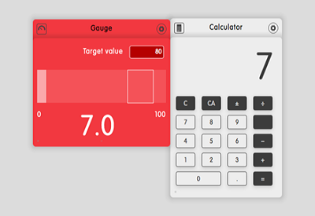
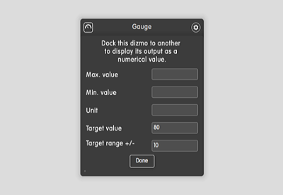

# Gauge

## Screenshots

## Description

Dock Gauge to another dizmo to display its output as a numerical value. You can set a maximum and a mininum, target value and range at the back so that if the value of the docked dizmo approaches one of these thresholds, Gauge changes its color accordingly.

## What is new in V0.3.x

* Edit help.
* Add screenshots.
* Add preview.

### V0.3

* Add help.
* Add indicator bar, change framecolor, docking.

## Works well with

* Calculator
* Sticky Notes
* Weather

## Additional information

Developer: dizmo AG 
Contact: support@dizmo.com 
Website: [www.dizmo.com](https.www.dizmo.com) 

